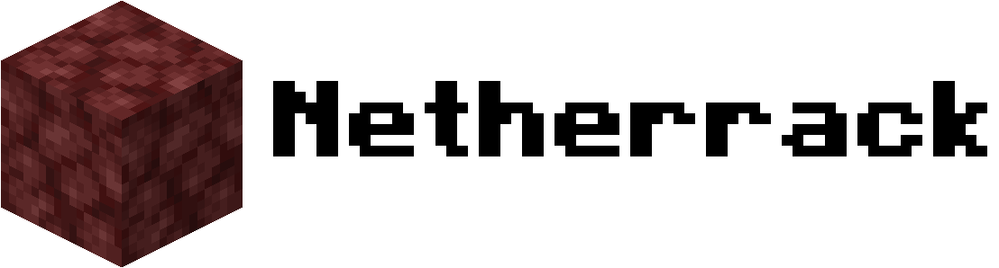

<p align="center">
  <picture>
    <source media="(prefers-color-scheme: dark)" srcset=".github/logo-dark.png">
    <source media="(prefers-color-scheme: light)" srcset=".github/logo-light.png">
    
  </picture>
</p>

<p align="center"><b>Open source server software for Minecraft: Bedrock Edition written in Java</b></p>

<p align="center">
  
  
  
  
  
</p>

# ℹ️ Information
Netherrack is an experimental vibe coded Minecraft: Bedrock Edition server software project focused on learning, experimentation, and building a server implementation from the ground up.
> [!IMPORTANT]
> Netherrack is not afilliated with Mojang or Microsoft.

# 🛠️ Getting started
Netherrack is written and running in Java 17. So you need to install Java 17 or newer. After you've installed Java 17 or newer, there is currently one way to install Netherrack.

## 🔧 Compiling from source
To compile Netherrack from source, you'll need:
- Git
- Maven 3 or newer
- Java 17 or newer

Run these commands in your terminal or command prompt:
```
git clone https://github.com/NetherrackOSS/Netherrack
cd Netherrack
```

To compile the project, run this command if you're on a Unix-based OS like Mac or Linux.
```
./mvnw clean package
```
Or if you're on Windows:
```
mvnw.cmd clean package
```

After running compiling, the Java archive file should be located at the ``target`` directory of the source code.

After running ``java -jar netherrack-0.1.0-SNAPSHOT.jar`` or launching it via a start script for the first time, you should see something like this:

```
[16:01:07] [main] [INFO] Starting Netherrack server version 0.1.0
[16:01:07] [main] [INFO] First-time setup detected. Launching setup wizard...

═══════════════════════════════════════════════════════════════
         Netherrack Setup Wizard - Language Selection
═══════════════════════════════════════════════════════════════

Welcome! Please select a language first.

[*] Enter a language code from the list below (press Enter for default).
  [en-US] English (United States)
  [pt-BR] Português (Brasil)

» Language [en-US]: 
```

> Encountering issues? Ensure Java 17 or newer is installed (run ``java --version`` on your terminal or command prompt to check your Java version) and that port 19132 isn't already in use.

## 🚧 Current status

Netherrack is currently in **early development**.

The project started as a server-software simulation and is gradually being turned into a real Bedrock server. Features are incomplete and APIs may change significantly.

### Currently implemented

- [x] Java/Maven project
- [x] Server startup and shutdown lifecycle
- [x] `server.properties` configuration
- [x] Console command handling
- [x] Colored console logging
- [x] Linux support/testing
- [x] RakNet networking
- [x] Bedrock protocol integration
- [x] Basic Bedrock login handling
- [x] Initial block system
- [x] Grass block
- [x] Cobblestone block
- [ ] Complete world system
- [ ] Chunk loading and generation
- [x] Client connection to a Bedrock client
- [ ] Complete Bedrock play/login flow
- [ ] Entity system
- [ ] Persistent world storage
- [ ] Plugin API
- [ ] More blocks and gameplay features

## 🧱 Project goals

The long-term goal is to create a flexible, open-source Bedrock server software implementation while learning more about Java, networking, Minecraft's Bedrock protocol, world systems, and server architecture.

Netherrack is **not intended to be a clone of another server implementation**. The server architecture and functionality are being developed independently.

## 🌐 Networking

Netherrack uses open-source CloudburstMC components for networking and Bedrock protocol functionality.
